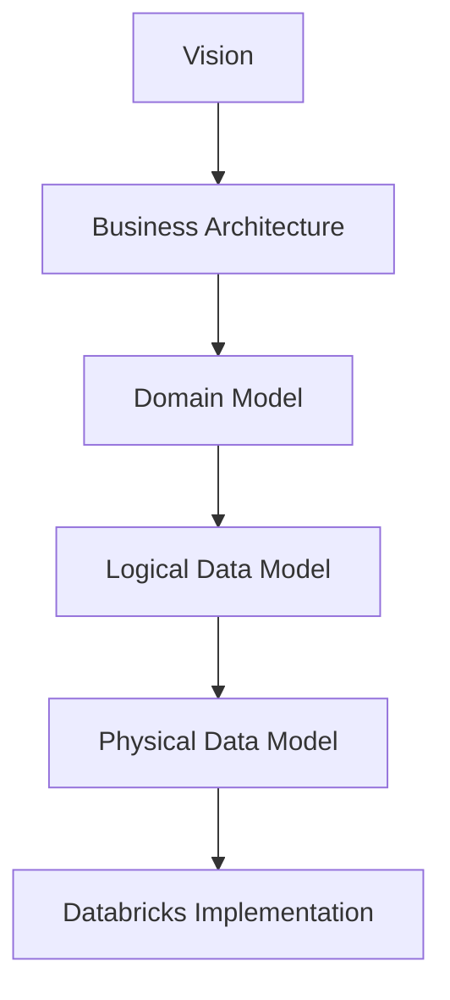

# Business Architecture

## Účel

IT Asset Planning Platform podporuje řízení životního cyklu IT zařízení a plánování jejich obměny.

Platforma propojuje aktuální stav zařízení, organizační strukturu, lifecycle pravidla, standardy vybavení a cenové podklady. Na jejich základě vytváří plán obměny a odhaduje jeho finanční i realizační dopad.

Platforma nenahrazuje provozní evidenci majetku, účetnictví, nákupní systém ani HR systém. Data z těchto systémů využívá jako vstupy pro plánování.

---

## Architektonické moduly

### 1. Current State

Obsahuje aktuální stav organizace a IT vybavení.

Hlavní oblasti:

- nemocnice a budovy,
- patra a pracoviště,
- zaměstnanci, role a organizační přiřazení,
- zařízení a jejich umístění,
- uživatelé zařízení,
- odpovědní vlastníci zařízení,
- stav zařízení,
- skladová a dostupná zařízení.

Modul odpovídá na otázku:

> Jaká zařízení organizace aktuálně má, kde se nacházejí a kdo za ně odpovídá?

---

### 2. Rules & Standards

Obsahuje pravidla používaná pro vyhodnocení a plánování.

Hlavní oblasti:

- životnost konkrétních modelů zařízení,
- standardní vybavení podle zaměstnanecké role,
- standardní vybavení pracoviště,
- standardní vybavení budovy,
- pravidla odpovědnosti,
- katalog zařízení a pořizovací ceny,
- katalog služeb a realizační ceny.

Modul odpovídá na otázku:

> Jaké vybavení má být k dispozici a podle jakých pravidel se má obměňovat?

---

### 3. Lifecycle Evaluation

Vyhodnocuje životní cyklus jednotlivých zařízení.

Pro každé zařízení určuje například:

- stáří zařízení,
- plánovaný konec životnosti,
- zbývající dobu životnosti,
- lifecycle stav,
- rok plánované obměny,
- důvod plánované obměny.

Provozní životnost je primárně řízena pravidlem konkrétního modelu zařízení.

Účetní údaje mohou být využity jako doplňující informace, ale samy neurčují termín provozní obměny.

Modul odpovídá na otázku:

> Která zařízení se blíží konci životnosti nebo již mají být obměněna?

---

### 4. Replacement Planning

Vytváří návrh budoucího pokrytí potřeb organizace.

Při plánování posuzuje:

1. zařízení, která lze ponechat v provozu,
2. dostupná zařízení ve skladu,
3. opravená zařízení,
4. zařízení uvolněná z jiných pracovišť,
5. zařízení, která je nutné nově zakoupit.

Součástí plánování je také:

- přiřazení cílového modelu zařízení,
- určení zdroje náhrady,
- výpočet pořizovacích nákladů,
- odhad požadovaných služeb,
- odhad realizačních nákladů.

Modul odpovídá na otázku:

> Jakým způsobem bude budoucí potřeba vybavení pokryta?

---

### 5. Outputs

Z jednoho výpočtu vznikají dva hlavní pohledy.

#### Business Plan

Určený pro management, CIO a finance.

Obsahuje zejména:

- počet plánovaných obměn,
- počet nových nákupů,
- náklady na hardware,
- náklady na realizaci,
- celkový rozpočet,
- využití skladových a dostupných zařízení.

Odpovídá na otázku:

> Kolik bude plánovaná obměna stát?

#### Delivery Plan

Určený pro IT, dodavatele a projektové řízení.

Obsahuje zejména:

- zařízení určená k obměně,
- cílové modely,
- zdroj náhrady,
- cílové pracoviště,
- odpovědného vlastníka,
- požadované služby,
- odhad realizačního úsilí.

Odpovídá na otázku:

> Co konkrétně musí být provedeno?

---

## Tok informací

